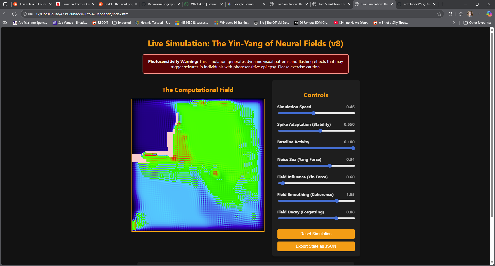

# Live Simulation: The Yin-Yang of Neural Fields
This project is a real-time, browser-based simulation of a 2D neural field. It visualizes how complex, 
organized patterns can emerge from the simple, local interactions of spiking neurons coupled by a shared
electric field (ephaptic coupling).

# What is This? 🧠

This simulation models a grid of Leaky Integrate-and-Fire neurons with spike-frequency adaptation. 
Instead of communicating only through direct synaptic connections, these neurons are influenced by a
shared ephaptic field.

The dynamics are governed by a balance of two forces, inspired by the Yin-Yang concept:

Yang (Active Force): A "Noise Sea" provides random energy, causing spontaneous neuron firing and promoting chaos.

Yin (Ordering Force): The "Field Influence" causes neurons to fire in response to the field, promoting coherent, organized structures.

The model for ephaptic coupling is inspired by the research paper In vivo ephaptic coupling allows memory network formation by 
Pinotsis & Miller (2023). The simulation implements the concept of an "activating function," where neurons are influenced not 
by the field's raw strength, but by its curvature (second spatial derivative). This creates more physically plausible and
visually distinct dynamics.

# Features

Interactive Controls: Adjust all key parameters of the simulation in real-time.

Speed Control: Slow down the simulation to observe dynamics closely, or pause it completely.

Reset & Export: Easily reset the simulation to its initial state or export the current state as a JSON file.

No Dependencies: Runs entirely in the browser. It's a single HTML file with embedded CSS and JavaScript.

# How to Run

Download the neuralfield_withephaptic_coupling_andspeed.html file.

Open it in any modern web browser (like Chrome, Firefox, or Edge).

That's it!

# ⚠️ Photosensitivity Warning
This simulation generates dynamic visual patterns and flashing effects that may trigger seizures in individuals with photosensitive epilepsy. 
Please exercise caution. The "Simulation Speed" slider can be used to slow down or pause the visuals if they become too intense.
